# From the bootstrap filter to the fully adapted filter of Section 4

The entropy rate estimator of [Section 4 of the paper](../../paper/paper.tex) is a *fully adapted*
particle filter: the two approximations a bootstrap filter makes at each step are both replaced by
exact closed-form calculations. The two properties of the quantized Gaussian model that allow this
are easy to state but easy to miss. This document sets out the standard machinery first, then those
two properties, then what they cost and what they do not buy.

Sections 2 through 4 are the standard material, kept here so that the notation and the two facts the
estimator leans on are on the page: the likelihood falls out of the filter weights, and its logarithm
is biased. Anyone who has run a particle filter can start at Section 5, where the paper's model
appears. Every figure is produced by [`make_figures.py`](make_figures.py) in this directory, which
carries readable implementations of every filter discussed; the production versions are in
[`egp/src/egp/pf.py`](../../egp/src/egp/pf.py) and [`egp/src/egp/pf.wgsl`](../../egp/src/egp/pf.wgsl).

**Contents**

1. [Why the entropy rate needs a filter](#1-why-the-entropy-rate-needs-a-filter)
2. [Monte Carlo, weights, and resampling](#2-monte-carlo-weights-and-resampling)
3. [The textbook particle filter](#3-the-textbook-particle-filter)
4. [The likelihood comes for free](#4-the-likelihood-comes-for-free)
5. [The paper's model as a state-space model](#5-the-papers-model-as-a-state-space-model)
6. [The fully adapted filter](#6-the-fully-adapted-filter)
7. [What can still go wrong](#7-what-can-still-go-wrong)
8. [From log-likelihood to entropy rate](#8-from-log-likelihood-to-entropy-rate)

---

## 1. Why the entropy rate needs a filter

The object of study is a stationary Gaussian process $X_t$ observed through a uniform quantizer,

$$Y_t = \operatorname{round}(X_t / \Delta) \in \mathbb{Z}.$$

The integer sequence $y_1, y_2, \dots$ is what a recording actually stores, and its entropy rate
$\bar H$ is the smallest average number of bits per sample any lossless coder can achieve.

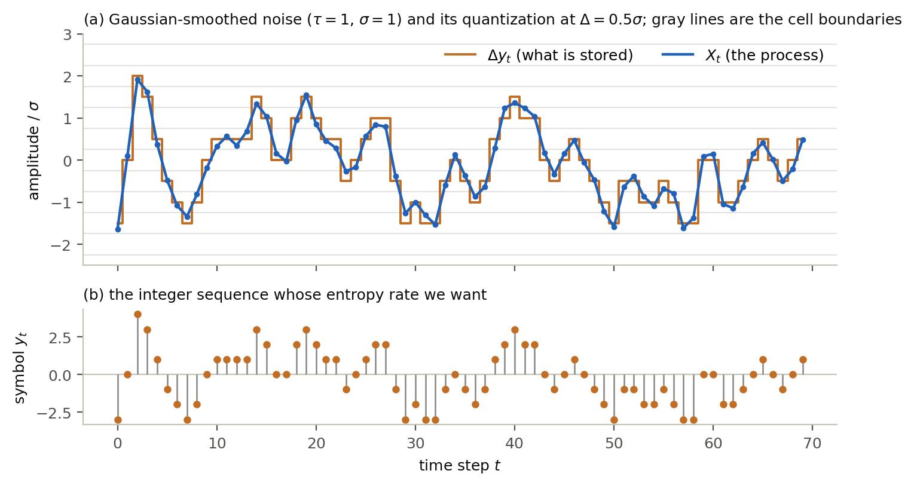

The picture already shows why the answer is not the entropy of a single symbol. The process is
smooth, so consecutive symbols repeat and drift rather than jump independently; a coder that looks
at the past can predict much of the next symbol. For the process above, coding each symbol on its
own costs 3.06 bits, while the entropy rate is 2.13 bits. The difference lives entirely in the
correlations.

The paper's route to $\bar H$ has two steps. First, the Shannon-McMillan-Breiman theorem says that
for a stationary ergodic process a single long typical sequence is enough:

$$\bar H = \lim_{n \to \infty} -\frac{1}{n} \log_2 P(y_1, \dots, y_n) \quad \text{almost surely}.$$

So we may draw one sequence from the process and compute its log-probability. Second, the chain rule
splits that log-probability into one-step pieces,

$$\log_2 P(y_1, \dots, y_n) = \sum_{t=1}^{n} \log_2 P(y_t \mid y_1, \dots, y_{t-1}),$$

each of which asks: given everything seen so far, how probable was the symbol that arrived?

That is a filtering question. Answering it requires carrying forward a summary of the past, updating
it with each new symbol, and using it to predict the next one. When the summary is a finite-dimensional
state and the model is linear and Gaussian, the Kalman filter does this exactly. Our model is linear
and Gaussian in its hidden part, but the observation is a rounding operation, which is neither, and no
exact recursion is available. A particle filter is the standard substitute: it represents the summary
by a population of samples.

## 2. Monte Carlo, weights, and resampling

Two ideas carry over from ordinary Monte Carlo.

**Importance sampling.** Suppose we want the distribution of $x$ given an observation $y$, and we can
draw from a prior $p(x)$ and evaluate the likelihood $p(y \mid x)$, but cannot draw from the posterior
$p(x \mid y) \propto p(x)\,p(y \mid x)$ directly. Draw $x^{(1)}, \dots, x^{(N)}$ from the prior and
attach to each the weight $w^{(i)} \propto p(y \mid x^{(i)})$. The weighted collection approximates the
posterior: for any function $f$,

$$\mathbb{E}[f(X) \mid y] \approx \sum_i w^{(i)} f(x^{(i)}), \qquad \sum_i w^{(i)} = 1.$$

**Resampling.** A weighted sample can be converted back into an unweighted one by drawing $N$ times
from it with probabilities $w^{(i)}$. Particles in low-weight regions disappear, high-weight particles
are duplicated, and every survivor again has weight $1/N$. This adds noise at a single step, so it is
never worth doing on its own, but it is what keeps a *sequential* algorithm from grinding to a halt,
as the next section shows.

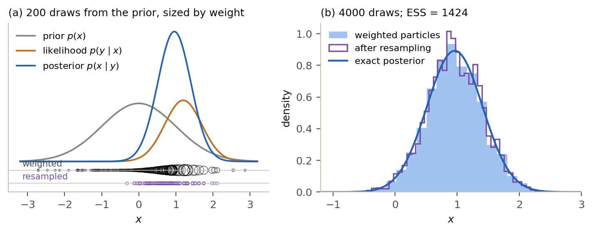

In panel (a) the prior draws spread over the whole axis and most of them fall where the posterior has
almost no mass; it is the weights that put the sample right. Resampling turns those weights into
positions: the purple row is the same 200 draws after resampling, and it covers the posterior rather
than the prior.
Panel (b) is the same thing at 4000 draws, where the weighted sample and the resampled one both
recover the exact posterior.

The health of a weighted sample is summarized by the **effective sample size**

$$\mathrm{ESS} = \frac{\left(\sum_i w^{(i)}\right)^2}{\sum_i \left(w^{(i)}\right)^2},$$

which equals $N$ when all weights are equal and $1$ when one particle carries everything. Loosely
speaking, a weighted sample of $N$ particles with $\mathrm{ESS} = M$ is worth about $M$ independent
draws. In panel (b) above, 4000 prior draws are worth about 1400.

The paper's estimator uses systematic resampling rather than the multinomial scheme just described:
one uniform draw $u \sim \mathrm{Unif}(0, 1/N)$ generates the whole set of $N$ positions
$u, u + 1/N, u + 2/N, \dots$ on the cumulative weight axis. It has the same expected offspring counts
and, in practice, a lower variance, which is why it is the usual choice. The advantage is not
unconditional: the error of systematic resampling depends on the order in which the particles happen
to be listed, and orderings are known for which it does not converge at all, whereas stratified
resampling is free of that defect (Gerber, Chopin, and Whiteley, 2019).

## 3. The textbook particle filter

A **state-space model** has a hidden state that evolves on its own and an observation that depends
only on the current state:

$$X_t \sim p(x_t \mid x_{t-1}), \qquad Y_t \sim p(y_t \mid x_t).$$

For the figures in this section we use the standard scalar example,
$X_t = 0.9 X_{t-1} + 0.5\,\varepsilon_t$ observed as $Y_t = X_t + 0.7\,\eta_t$ with
$\varepsilon, \eta$ independent standard normals. It is linear and Gaussian, so the Kalman filter
gives the exact answer to compare against.

The **bootstrap particle filter** maintains $N$ particles that represent the current filtering
distribution $p(x_{t-1} \mid y_{1:t-1})$, and advances them by three steps.

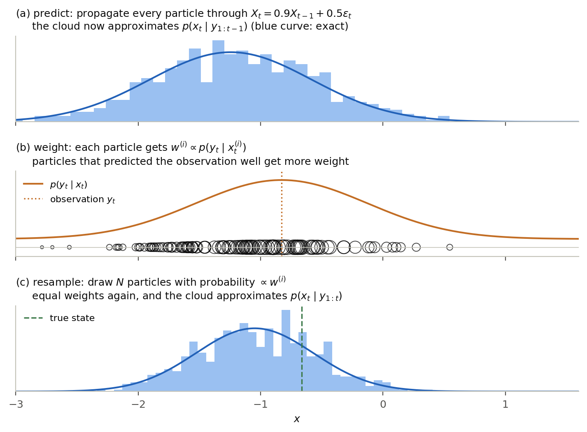

1. **Predict.** Push every particle through the dynamics, $x_t^{(i)} \sim p(x_t \mid x_{t-1}^{(i)})$.
   The cloud now approximates $p(x_t \mid y_{1:t-1})$, what we believe about the state *before* seeing
   $y_t$.
2. **Weight.** Score each particle by how well it explains the new observation,
   $w^{(i)} \propto p(y_t \mid x_t^{(i)})$. The weighted cloud approximates $p(x_t \mid y_{1:t})$.
3. **Resample.** Draw $N$ particles from the weighted cloud, restoring equal weights and readying the
   cloud for the next step.

Run over many steps, the cloud tracks the hidden state, and its spread is an honest picture of how
uncertain the state is.

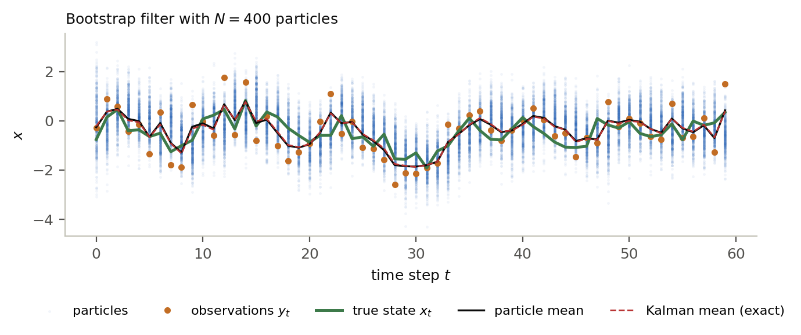

With 400 particles the particle mean is indistinguishable from the exact Kalman mean. The particles
are not tracking the observations, which are noisy, but the state behind them.

Step 3 is the one that looks unmotivated at first. Resampling throws away information and adds
variance, so why do it every step? Because without it the weights of a sequential scheme multiply,
and a product of many random factors is dominated by its largest term.

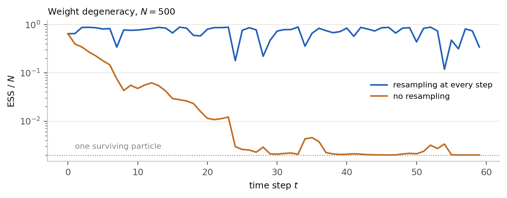

Without resampling the effective sample size falls to one within about twenty-five steps: all but a
single particle have become numerically irrelevant, and the filter is a very expensive way of doing
nothing. With resampling at every step it stays near 80 percent of $N$ indefinitely. The price is
that particles share ancestors, an effect that returns in Section 7.

In code the whole filter is short:

```python
x = sample_from_prior(N)                      # the state before any data
for t in range(n):
    x = propagate(x)                          # 1. predict: x_{t-1} -> x_t
    w = likelihood(y[t], x)                   # 2. weight, using the new state
    w /= w.sum()
    x = x[systematic_resample(w, rng)]        # 3. resample
```

**What exactly is a particle?** In this example the state is a single number, so a particle is a
single number and the cloud is a list of $N$ of them. That is a feature of the example, not of
particle filters. In general a particle is one complete hypothesis about the current state, whatever
the state happens to be: if the state is a vector of length $d$, then each particle is a vector of
length $d$ and the cloud is an $N \times d$ array. The three steps are unchanged, since propagating,
weighting, and resampling never look inside the state. Section 5 introduces a model whose state is a
vector, and it is worth carrying this distinction into it.

## 4. The likelihood comes for free

The filter was introduced as a way of tracking a state, but what we actually want is the
log-probability of the observed sequence. It falls out of the weights at no extra cost.

Before normalization, the average weight at step $t$ estimates the one-step predictive probability:

$$\hat P(y_t \mid y_{1:t-1}) = \frac{1}{N} \sum_i p(y_t \mid x_t^{(i)}),$$

because the particles $x_t^{(i)}$ are (approximately) draws from $p(x_t \mid y_{1:t-1})$, and
averaging the likelihood over that distribution is exactly the predictive probability. Multiplying
these across $t$ gives an estimate of $P(y_{1:n})$, and taking logs turns the product into the sum the
chain rule asked for.

This estimator has a remarkable property: $\hat P(y_{1:n})$ is **unbiased** for $P(y_{1:n})$, exactly,
at any particle count, resampling and all. The result goes back to the earliest analyses of
interacting particle filters; the statement the paper uses is Proposition 7.4.1 of Del Moral (2004),
for multinomial resampling. It carries over to systematic resampling because the offspring counts
remain conditionally unbiased.

Unbiasedness on the probability scale is not unbiasedness on the log scale. Since the logarithm is
concave, Jensen's inequality gives

$$\mathbb{E}\left[\log \hat P(y_{1:n})\right] \le \log P(y_{1:n}),$$

so the filter systematically *underestimates* the log-probability, and the entropy estimate
$-\frac{1}{n}\log_2 \hat P$ is systematically **too high**. The size of the gap is governed by the
variance of $\hat P$, which is $O(1/N)$ per step.

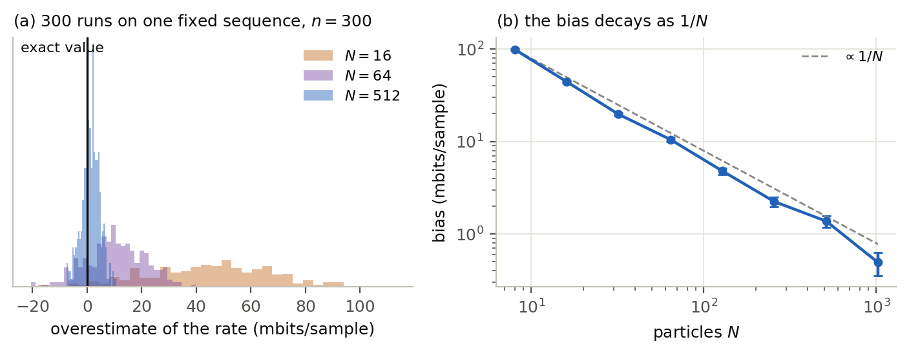

The effect is easy to see on the scalar model, where the exact log-likelihood is available from the
Kalman filter. At $N = 16$ the overestimate is 44 millibits per sample; by $N = 1024$ it is 0.5, and
the decay follows $1/N$ across two decades. This is the first of the two biases discussed in
Section 4.4 of the paper, and it is the reason the estimator is a converging-from-above estimate
rather than an unbiased one. The practical consequence is the convergence check: raise $N$ until the
estimate stops falling.

## 5. The paper's model as a state-space model

Now to the actual problem. Nothing so far applies to it directly, because a Gaussian process
specified by a spectral density $S(\omega)$ has no obvious finite-dimensional state. The paper
manufactures one.

Any such process can be written as a moving average of independent Gaussian innovations,

$$X_t = \sum_{j=0}^{L-1} h_j W_{t-j}, \qquad W_t \overset{\text{iid}}{\sim} \mathcal{N}(0,1),$$

with taps $h$ satisfying $|\hat h(\omega)|^2 = S(\omega)$. Among the possible spectral square roots
the paper takes the **minimum-phase** one, for a reason that matters here: it makes the leading tap
$h_0$ as large as possible, and $h_0$ is precisely the standard deviation of $X_t$ given the entire
past, the one-step prediction error of the process:
$h_0^2 = \exp\left(\frac{1}{2\pi}\int_{-\pi}^{\pi} \ln S(\omega)\,d\omega\right)$. A symmetric square
root would put nearly all of the energy in the middle taps, leave $h_0$ almost zero, and make the
filter below degenerate.

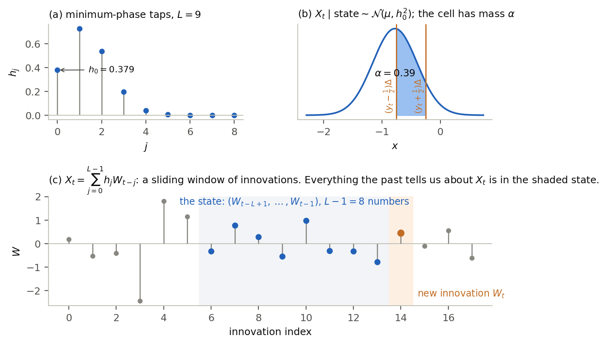

Written this way, the process is a state-space model. Since $X_t$ involves only
$W_t, W_{t-1}, \dots, W_{t-L+1}$, everything the past can say about $X_t$ is contained in the $L-1$
innovations $W_{t-1}, \dots, W_{t-L+1}$. That vector is the state. It advances by shifting in the new
$W_t$ and dropping the oldest, and given the state,

$$X_t = h_0 W_t + \mu, \qquad \mu = \sum_{j=1}^{L-1} h_j W_{t-j},$$

so $X_t \mid \text{state} \sim \mathcal{N}(\mu, h_0^2)$. Here $\mu$ is the best prediction of $X_t$
from the past and $h_0$ is the error of that prediction. Panel (c) of the figure shows one such
window, taken from the process itself. The filter never sees it: the innovations are hidden, and
recovering them is the filtering problem.

Two questions about this choice of state are worth settling before going on. Why is the state a
vector rather than a number? Because $X_t$ by itself is not Markov. It depends on the whole past
rather than on $X_{t-1}$ alone, so no scalar summary of the past would be enough, and the shortest
summary that is enough has $L-1$ components. Why innovations rather than the last few values of $X$?
Because a window of past $X$ values is not a state here at all: for a moving average, $X_t$ is not a
function of finitely many past values plus a new innovation, and in any case those values are never
observed exactly, only through the cells that contain them. The innovation window is the summary that
makes both the update and the conditional law above exact and finite.

The observation is where this model departs from the textbook. Seeing $Y_t = y_t$ does not give a
noisy measurement of $X_t$; it says that $X_t$ fell inside a known interval,

$$\mathcal{C}_{y_t} = \left[(y_t - \tfrac12)\Delta,\ (y_t + \tfrac12)\Delta\right).$$

The observation likelihood is therefore a Gaussian interval probability. In standardized units,

$$l = \frac{(y_t - \tfrac12)\Delta - \mu}{h_0}, \qquad r = l + \frac{\Delta}{h_0}, \qquad
P(Y_t = y_t \mid \text{state}) = \Phi(r) - \Phi(l) =: \alpha,$$

with $\Phi$ the standard normal CDF. Two things follow immediately, and together they are the reason
the filter works so well.

- The dimensionless ratio $\Delta / h_0$, the quantization step measured in units of the one-step
  prediction error, is the parameter that governs the difficulty of the problem. It is not
  $\Delta / \sigma$: a smooth process can be finely quantized in absolute terms while each new symbol
  is still nearly determined by the past.
- Conditional on the observed cell, the new innovation $W_t$ is a standard normal **truncated to
  $[l, r)$**, which we can sample from exactly.

### What a particle is in this model

A particle is a copy of the state, so here each particle is $L-1$ numbers: one guess at each of
$W_{t-1}, W_{t-2}, \dots, W_{t-L+1}$. The cloud is an $N \times (L-1)$ array, one row per particle.
Every particle has seen the same symbols $y_1, \dots, y_{t-1}$; what distinguishes them is which
innovation history they propose as the explanation, and the population as a whole represents the
uncertainty about that history. (The paper names the same window one step later, writing
$u_t = (W_{t-L+2}, \dots, W_t)$ for its state after the step at time $t$ has been taken. It is the
same $L-1$ numbers, shifted along by one.)

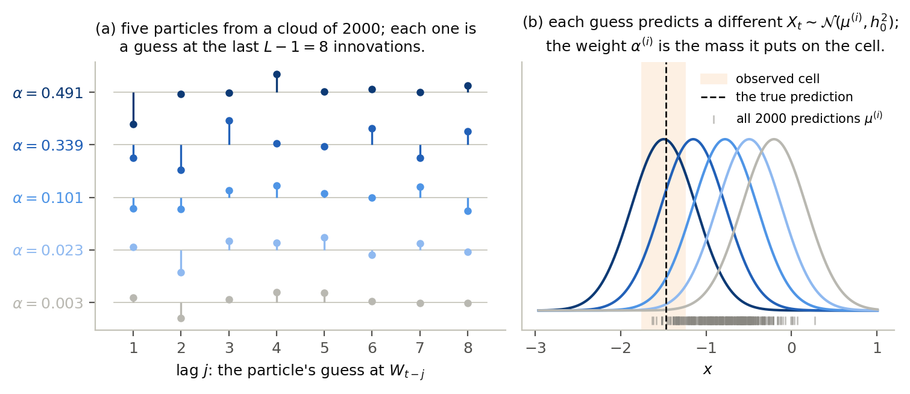

Panel (a) shows five particles from a cloud of 2000, as eight numbers each. Panel (b) shows what
those numbers are for: each particle turns its guess into a prediction
$\mu^{(i)} = \sum_{j \ge 1} h_j W^{(i)}_{t-j}$, and therefore into a different Gaussian for $X_t$.
The particle whose prediction sits over the observed cell puts mass $\alpha = 0.49$ on it; the one
farthest away puts $0.003$. Because the taps decay quickly here
($h_1 = 0.73$ against $h_7 = 1 \times 10^{-5}$), the first few lags do most of the work, and two
particles that disagree only about $W_{t-7}$ receive nearly the same weight.

The gray ticks along the bottom of panel (b) are the predictions of all 2000 particles. Their spread
is the filter's uncertainty about $X_t$ before the symbol arrives, and the weighting step is what
selects, from that spread, the part consistent with the symbol that did arrive.

## 6. The fully adapted filter

Apply the bootstrap recipe of Section 3 to this model and something goes wrong. The blind proposal
draws $W_t \sim \mathcal{N}(0,1)$ without looking at $y_t$, and then the weight
$p(y_t \mid x_t) = \mathbf{1}\{X_t \in \mathcal{C}_{y_t}\}$ is either one or zero. Particles that
happen to land in the observed cell survive; the rest are wasted. The observation is deterministic
given the state, which is the worst case for a blind proposal.

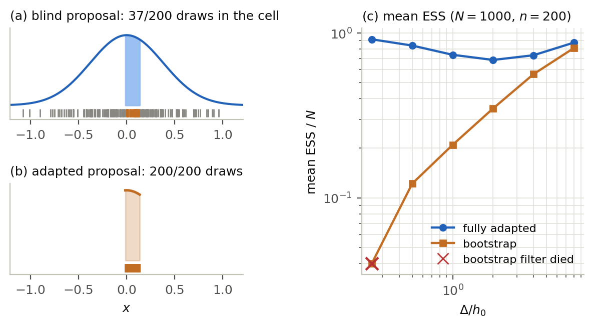

Panel (a) shows one particle at $\Delta / h_0 = 0.4$: about one draw in six lands in the cell, so a
filter with $N = 1000$ particles is doing the work of roughly 160. Panel (c) makes this quantitative
across a range of $\Delta / h_0$ on a real process, and the bootstrap filter does not merely lose
precision. At $\Delta / h_0 = 0.25$ it died at step 2, meaning every one of its 1000 particles
contradicted the observation and there was nothing left to resample.

The fix is to use the observation *before* proposing rather than after. Two facts make this exact
here:

- $\alpha^{(i)} = P(Y_t = y_t \mid \text{state}^{(i)}) = \Phi(r^{(i)}) - \Phi(l^{(i)})$ can be
  computed in closed form and depends only on the *old* state, so the particles can be weighted and
  resampled before anything new is drawn.
- $p(W_t \mid y_t, \text{state}^{(i)})$ is a truncated normal, so the new innovation can be drawn from
  its exact conditional distribution.

A filter with these two properties is called **fully adapted** in the terminology of Pitt and
Shephard's auxiliary particle filter. The weight and the resampling use the exact predictive
probability, and the propagation uses the exact conditional, so no importance weight survives the
step: after propagation all particles again have weight $1/N$, and no proposal approximation enters
the estimate anywhere. The order of the three operations is simply reversed relative to the bootstrap
filter, weight and resample first, propagate second:

```python
u = rng.standard_normal((N, L - 1))            # state: the last L-1 innovations
for t in range(n):
    mu = u @ taps[1:]                          # each particle's prediction of X_t
    lo = ((y[t] - 0.5) * delta - mu) / h0      # the observed cell in standardized units
    hi = lo + delta / h0

    log_alpha = log_cell_prob(lo, hi)          # 1. weight: log(Phi(hi) - Phi(lo))
    step = logsumexp(log_alpha) - log(N)       # 2. log P(y_t | y_1..y_{t-1})
    loglik += step

    a = systematic_resample(exp(log_alpha), rng)          # 3. resample
    w_new = sample_truncnorm(lo[a], hi[a], rng)           # 4. propagate, exactly
    u = concatenate([w_new[:, None], u[a][:, :-1]], axis=1)
```

That is the whole estimator. Each step costs $O(NL)$, dominated by the prediction $\mu$ and by two
evaluations of the log-space normal CDF and one of its inverse per particle; the memory is $O(NL)$.

Panel (c) of the figure above shows what full adaptation buys: the effective sample size stays
between 69 and 92 percent of $N$ across the whole range of $\Delta/h_0$, where the bootstrap filter
falls from 81 percent at the coarsest step to 12 percent at $\Delta/h_0 = 0.5$ and outright failure
below that. Note what it does *not* buy. The weights
are not all equal, because $\alpha^{(i)}$ measures how well each particle's *past* predicted the
current symbol, and particles differ in that. Full adaptation removes the approximation within a
step, not the differences between particles.

Two implementation points from the paper are worth naming, since they are where a first attempt
usually breaks.

- **Everything is in log space.** When a particle's prediction is far from the observed cell,
  $\Phi(r) - \Phi(l)$ underflows to zero in double precision, and the difference of two nearly equal
  values loses all precision when both endpoints are large and positive. Appendix A of the paper
  gives the stable form, based on $\log \Phi$ and a reflection that keeps the endpoints on the side
  where it retains precision.
- **The truncated draw reuses the weight's work.** Inverting $\log \Phi$ on a point interpolated
  between the endpoints produces the truncated normal draw from quantities the weight step already
  computed.

## 7. What can still go wrong

Resampling at every step keeps the weights healthy, but it also means that particles share ancestors.
Since the state is a window of the last $L-1$ innovations, a state vector is assembled over $L-1$
consecutive steps and is inherited from a single ancestor most of the way back. If the whole
population descends from an ancestor that was wrong, there is no diversity left to recover with.

This is the failure mode described in Appendix B of the paper. For a strongly smoothing process the
inverse filter is close to the unit circle, so a small error in the state is amplified at the next
step rather than forgotten. Once the cloud has drifted more than a cell away, every particle is
forced to draw an extreme innovation to match the observation, which worsens the error, and the
filter never comes back. What it reports afterward is not a noisy estimate of the entropy rate but an
arbitrary number.

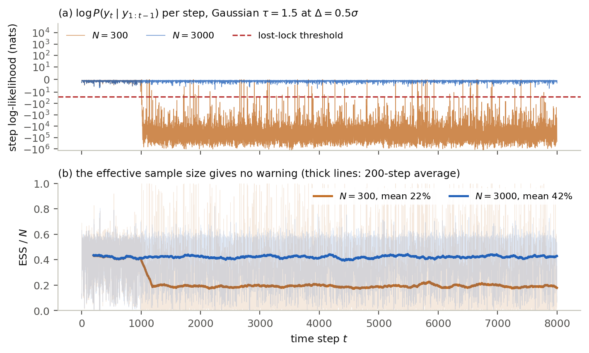

The run with $N = 300$ tracks correctly for about a thousand steps and then loses the state, after
which the per-step log-likelihood drops by thousands of nats and the reported rate is
$2.6 \times 10^5$ bits per sample, against the correct 1.64. Nothing subtle is happening: the failure
is catastrophic and unmistakable *if you look at the right quantity*.

The effective sample size is the wrong quantity. Panel (b) shows it falling from 43 percent to about
20 percent when the filter loses the state, which is a range that looks entirely healthy; a filter
running at 20 percent ESS would not ordinarily raise an alarm. The reason is that ESS measures
whether the particles agree with *each other*, not whether they agree with the data, and once every
particle is comparably far from the truth they agree very well. In the GPU runs reported in Table 1
of the paper the collapsed ESS is actually *higher* than the healthy one, up to 99 percent.

The diagnostic that does work reads the log-likelihood itself. A particle whose prediction sits $d$
prediction standard deviations from the observed cell contributes about
$\log(\Delta/h_0) - d^2/2$ nats, so a filter that is tracking at all cannot fall far below
$\log \min(1, \Delta/h_0)$ per step. The paper flags a step as lost-lock when it falls 25 nats below
that level, and discards any replicate with lost-lock steps rather than averaging it in. The scale
term matters: under fine quantization every step is legitimately worth about $\log(\Delta/h_0)$ nats,
so a fixed threshold would produce false alarms.

The practical rule from Section 5.1 of the paper is to increase $N$ until no replicate loses lock. How
large that is depends on the process, not on the state dimension alone: the AR(1) process carries a
63-dimensional state and converges at 125 particles, while the 33-tap lowpass filter needs 100 000.

## 8. From log-likelihood to entropy rate

The last step is the one the Shannon-McMillan-Breiman theorem licensed at the outset. Accumulate the
per-step log-likelihoods over one long sequence drawn from the process, and divide:

$$\hat{\bar H} = -\frac{1}{n \ln 2} \sum_{t=1}^{n} \ln \hat P(y_t \mid y_{1:t-1}) \ \ \text{bits per sample}.$$

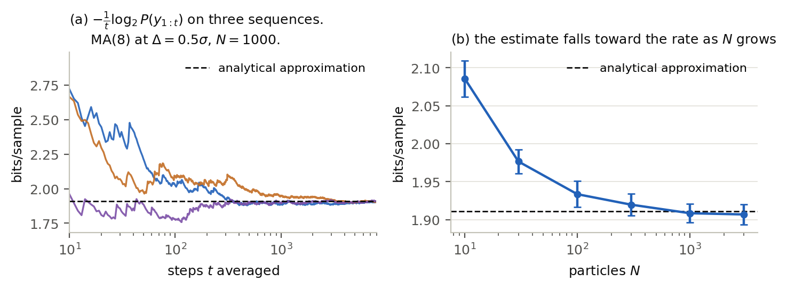

Panel (a) shows the running average settling down on three independent sequences from the MA(8)
process at $\Delta = 0.5\sigma$. By the end of the sequences the three agree with one another to
within 5 millibits and sit 2 to 6 millibits below the analytical approximation of Section 3, which
is the side the approximation is expected to fall on. Panel (b) shows the
Jensen bias of Section 4 on the real problem: at $N = 10$ the estimate sits 0.18 bits above the
approximation, and it falls monotonically toward the rate as $N$ grows.

The two parameters do different jobs, which is the practical lesson of Section 5.1 of the paper:

- **$N$ controls the bias.** It decays as $O(1/N)$ for processes of moderate difficulty, more slowly
  for hard ones. Increasing $n$ does not help with it.
- **$n$ controls the variance.** The standard deviation across replicates falls as $1/\sqrt{n}$, and
  since only the total sample count matters, a fixed budget can be spent on a few long sequences or
  many short ones. Short replicates are in fact preferable for hard processes, because every step is
  an opportunity to lose lock, so shorter runs need fewer particles to stay locked.

To run it:

```sh
pip install -e "egp[gpu]"     # drop [gpu] for the NumPy engine
egp estimate --preset ma --taps 8 --delta 0.5 -n 20000 -N 1000 -r 3
```

The CLI streams one line per replicate with a running mean and standard error, tags any replicate
that lost lock, and prints the analytical approximation alongside the estimate as an independent
check. Adding `--engine gpu` runs the same filter as a WGSL compute shader, one workgroup per
replicate, which is roughly twenty times faster at large particle counts.

## Where to go next

- [Section 4 of the paper](../../paper/paper.tex) states the algorithm formally, with the numerically
  stable arithmetic in Appendix A and the collapse diagnostic in Appendix B.
- [`egp/src/egp/pf.py`](../../egp/src/egp/pf.py) is the reference implementation, and
  [`egp/README.md`](../../egp/README.md) documents the CLI, the spectral factorization, and the
  choice of particle count.
- [`make_figures.py`](make_figures.py) in this directory reproduces every figure above and contains
  the filters in full, including the bootstrap filter for the quantized model, if you want to watch
  it fail.
- Classic references: Pitt and Shephard (1999) for the auxiliary particle filter and full adaptation,
  Del Moral (2004, Prop. 7.4.1) for the unbiasedness of the likelihood estimator, Gerber, Chopin, and
  Whiteley (2019) for what the various resampling schemes do and do not guarantee, and Arnold et al.
  (2006) and Dauwels and Loeliger (2008) for the use of filter log-likelihoods to compute information
  rates.
